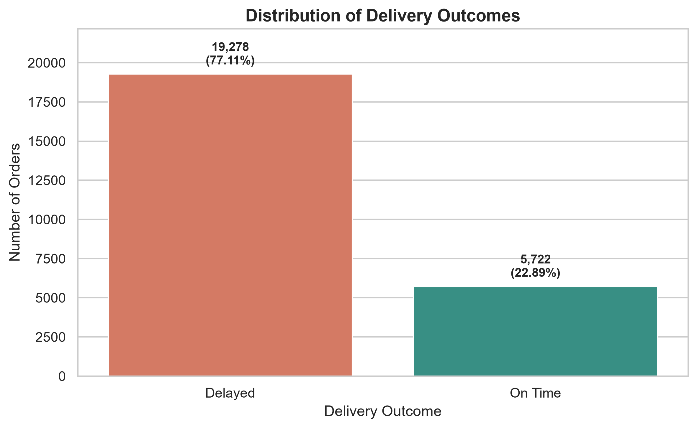
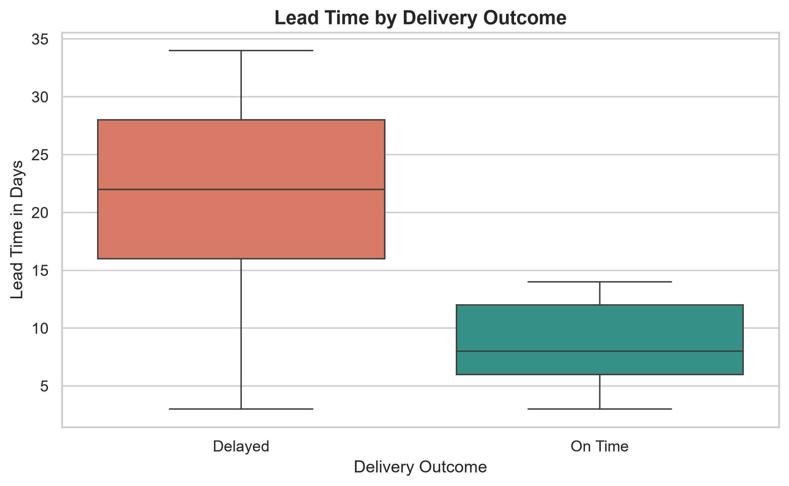
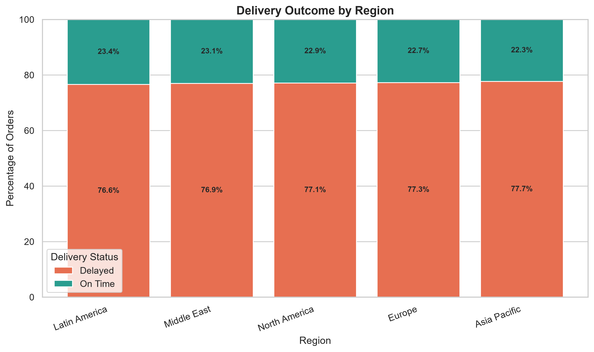
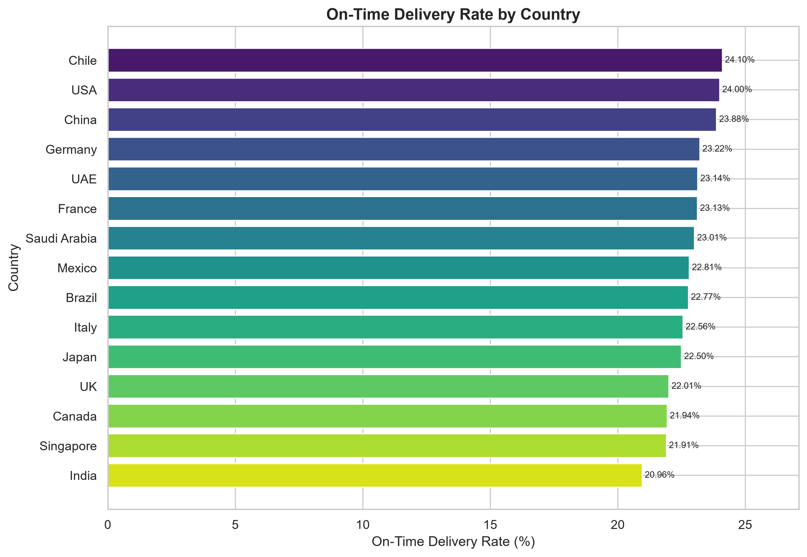
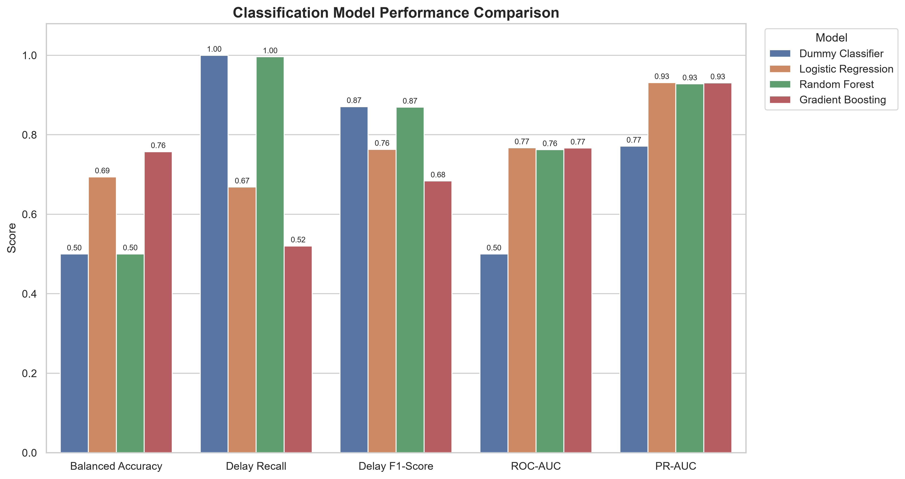
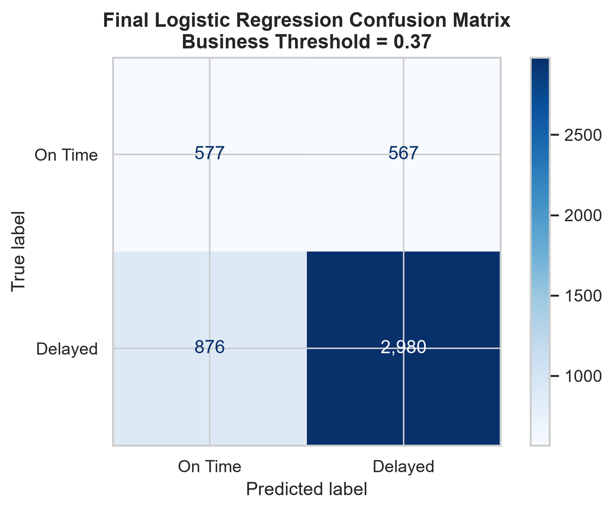
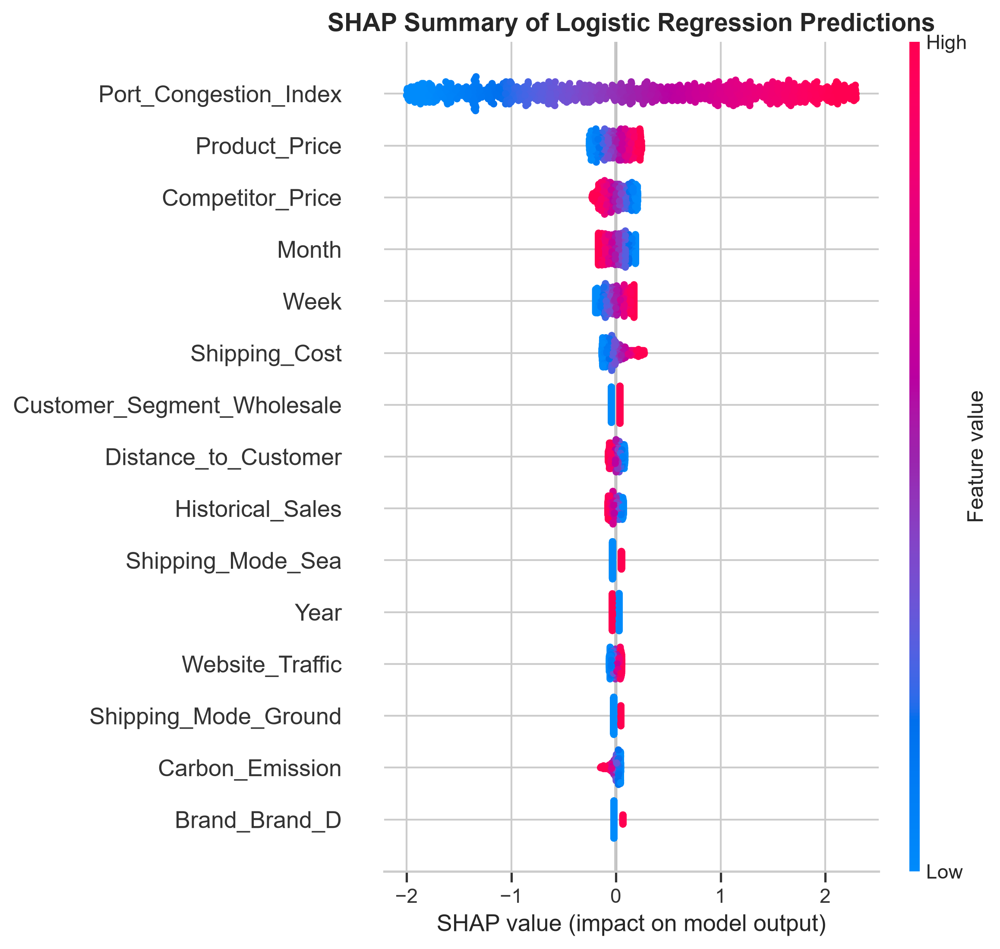
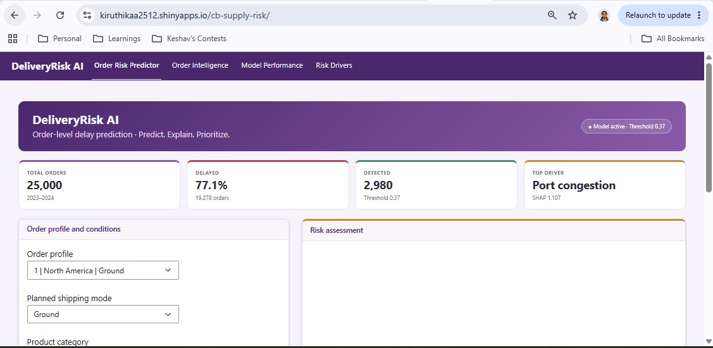
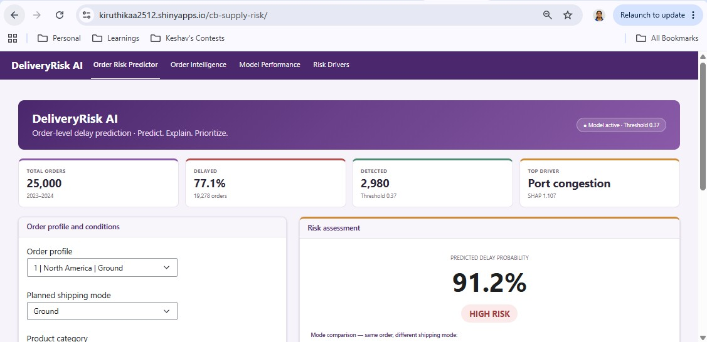
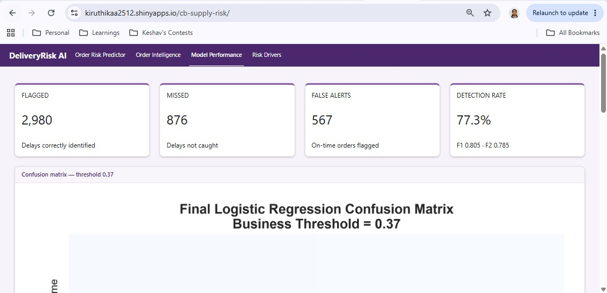

# AI-Driven Delivery Risk Prediction and Explainable Decision Support for Cross-Border E-Commerce Supply Chains

> An end-to-end MS Data Analytics capstone project focused on predicting delivery delays, interpreting model behavior, and translating the results into a supplementary decision-support dashboard.

---

## Project Information

- **Author:** Kiruthikaa Natarajan Srinivasan
- **Course:** 44688-80 – MS Data Analytics Capstone
- **Instructor:** Ajay Bandi
- **University:** Northwest Missouri State University
- **Date Prepared:** July 2026
- **Last Updated:** August 2026
- **Current Phase:** Final Report and Capstone Submission
- **GitHub Repository:** [cb_supply_risk](https://github.com/Kiruthikaa2512/cb_supply_risk)

---

## Project Overview

Cross-border e-commerce supply chains involve suppliers, warehouses, transportation providers, ports, customs processes, tariffs, currencies, inventory decisions, and changing market conditions. These connected factors can increase the likelihood of shipment delays and affect customer satisfaction, inventory availability, logistics cost, and overall supply-chain performance.

This project develops an explainable machine learning approach for predicting whether a cross-border e-commerce shipment is likely to be delayed. The work covers data inspection, cleaning, exploratory analysis, feature preparation, model comparison, threshold optimization, final evaluation, SHAP-based interpretation, and business-oriented communication of results.

A supplementary PyShiny dashboard was also developed and deployed as a public web application to demonstrate how the selected model can support order-level delay-risk prioritization.

---

## Research Question

> Can operational, supplier, logistics, inventory, economic, and geographic attributes be used to predict whether a cross-border e-commerce shipment will be delivered on time or delayed?

---

## Project Objectives

The project objectives are to:

1. Predict whether a cross-border e-commerce shipment is likely to be delayed.
2. Examine operational, supplier, logistics, economic, inventory, and geographic factors related to delivery performance.
3. Compare multiple machine learning models.
4. Address the imbalance between delayed and on-time delivery records.
5. Select a practical operating threshold for delay-risk identification.
6. Use SHAP to explain the selected model.
7. Present the results through a supplementary PyShiny decision-support dashboard.

---

## Data Source

The project uses the **Cross-Border E-Commerce Supply Chain Dataset** from Kaggle.

- **Dataset:** [Cross-Border E-Commerce Supply Chain Dataset](https://www.kaggle.com/datasets/ziya07/cross-border-e-commerce-supply-chain-dataset)
- **Dataset creator:** Ziya
- **Dataset type:** Synthetic supply-chain data
- **Raw data file:** `data/raw/cross_border_ecommerce_supply_chain_dataset.csv`
- **Cleaned data file:** `data/processed/cross_border_ecommerce_supply_chain_cleaned.csv`

The dataset is synthetic and is used for academic analysis. Results should therefore be validated on real operational data before practical implementation.

---

## Dataset Summary

The original dataset contains:

- **25,000 records**
- **43 original attributes**
- **730 unique dates**
- **5 product categories**
- **5 brands**
- **5 regions**
- **15 countries**
- **2 customer segments**
- **4 warehouse identifiers**
- **3 shipping modes**

The data covers the period from **January 1, 2023 through December 30, 2024**.

The original delivery outcome variable is:

```text
Delivery_Time_OnTime
```

For modeling, a derived target was created:

```text
Delivery_Delayed
```

where:

- `1` = Delayed
- `0` = On Time

---

## Project Workflow

1. Problem definition
2. Data collection and inspection
3. Data cleaning and validation
4. Exploratory Data Analysis
5. Feature selection
6. Train-test split
7. Numerical scaling and categorical encoding
8. Baseline model development
9. Model training and comparison
10. Threshold analysis
11. Final model evaluation
12. SHAP explainability
13. Supplementary PyShiny dashboard development
14. Production deployment on shinyapps.io
15. Results interpretation and conclusions

---

# Data Inspection and Cleaning

The dataset was evaluated for:

- missing values
- blank strings
- hidden missing-value placeholders
- duplicate rows
- duplicate order identifiers
- categorical inconsistencies
- incorrect data types
- invalid numerical ranges
- invalid dates
- month and year mismatches

## Data-Quality Results

- **Missing values:** 0
- **Blank-string values:** 0
- **Common missing-value placeholders:** 0
- **Exact duplicate rows:** 0
- **Duplicate `Order_ID` values:** 0
- **Invalid dates:** 0
- **Month mismatches:** 0
- **Year mismatches:** 0

No records or attributes were removed during cleaning.

## Cleaning Actions

- Created a separate cleaned dataframe
- Converted `Date` to datetime format
- Removed leading and trailing spaces from text attributes
- Preserved the original raw dataset
- Retained all 25,000 records
- Exported the cleaned dataset to `data/processed/`

---

# Exploratory Data Analysis

A readable `Delivery_Status` field was added for charts and tables. The EDA dataframe contains **25,000 rows and 44 columns**, including the added display field.

No scaling, encoding, resampling, class balancing, or outlier removal was applied before EDA.

## Delivery Outcome Distribution

The target distribution is:

- **19,278 delayed orders – 77.11%**
- **5,722 on-time orders – 22.89%**

This class imbalance means that accuracy alone is not an appropriate evaluation measure.



## Lead Time by Delivery Outcome

Delayed orders average approximately **21 days**, while on-time orders average approximately **9 days**. This was one of the clearest descriptive differences identified during EDA.



## Delivery Performance by Region

Regional on-time rates are relatively close to one another, which suggests that delivery delays are widespread rather than isolated to one region.



## On-Time Delivery Rate by Country

Country-level percentages provide a more appropriate comparison than raw order counts because country sample sizes are unequal.



## Additional EDA Findings

- Product categories are distributed almost evenly.
- Shipping modes are distributed almost evenly.
- Geographic regions are distributed almost evenly.
- Country-level order counts are less balanced.
- Shipping cost and carbon emission are right-skewed.
- High-value observations were retained because they may represent valid supply-chain conditions.
- Class imbalance influenced the model-evaluation strategy.

---

# Predictive Modeling

## Feature Preparation

The final modeling dataset used:

- **32 predictors**
- **25 numerical features**
- **7 categorical features**

The data was divided using an **80/20 stratified split**:

- **Training set:** 20,000 records
- **Test set:** 5,000 records

Numerical variables were standardized, and categorical variables were one-hot encoded. The preprocessing pipeline produced **64 transformed features**.

Identifier, outcome, leakage-prone, and optimization-related fields were excluded from the predictor set.

## Models Compared

The following models were evaluated:

- Dummy Classifier
- Logistic Regression
- Random Forest
- Gradient Boosting

## Model Comparison Results

| Model | Accuracy | Balanced Accuracy | Precision | Recall | F1 | ROC-AUC | PR-AUC |
|---|---:|---:|---:|---:|---:|---:|---:|
| Dummy Classifier | 0.7712 | 0.5000 | 0.7712 | 1.0000 | 0.8708 | 0.5000 | 0.7712 |
| Logistic Regression | 0.6802 | 0.6940 | 0.8893 | 0.6686 | 0.7633 | 0.7671 | 0.9312 |
| Random Forest | 0.7692 | 0.5002 | 0.7713 | 0.9961 | 0.8694 | 0.7624 | 0.9280 |
| Gradient Boosting | 0.6288 | 0.7575 | 0.9970 | 0.5202 | 0.6837 | 0.7665 | 0.9306 |



## Selected Model

Logistic Regression was selected because it provided:

- interpretable probabilities
- stronger class balance than the Dummy Classifier and Random Forest
- compatibility with threshold adjustment
- straightforward SHAP interpretation
- suitability for an explainable decision-support prototype

The model was not selected based on accuracy alone.

---

# Threshold Optimization

The default probability threshold of `0.50` was evaluated against alternative thresholds.

A business-oriented threshold of **0.37** was selected because it gave greater importance to identifying delayed orders and reduced missed-delay risk.

## Final Test Results at Threshold 0.37

| Metric | Result |
|---|---:|
| Accuracy | 0.7114 |
| Balanced Accuracy | 0.6386 |
| Delay Precision | 0.8401 |
| Delay Recall | 0.7728 |
| Delay F1 | 0.8051 |
| Delay F2 | 0.7854 |
| On-Time Recall | 0.5044 |

## Final Confusion Matrix

- **2,980 delayed orders correctly identified**
- **876 delayed orders missed**
- **567 on-time orders incorrectly flagged**
- **577 on-time orders correctly identified**



The selected threshold accepts additional false review alerts in exchange for identifying more delayed orders. This trade-off is appropriate for a risk-prioritization use case where missed delays may carry greater operational impact.

---

# Explainable AI with SHAP

SHAP was used to interpret the selected Logistic Regression model.

The analysis showed that `Port_Congestion_Index` was the strongest predictive signal. Product price, competitor price, month, week, and shipping cost provided secondary predictive information.



SHAP values represent predictive associations and should not be interpreted as proof of causation.

---

# Key Findings

1. Delayed deliveries represent 77.11% of the dataset.
2. Longer lead time is strongly associated with delayed delivery.
3. Accuracy alone is misleading because of class imbalance.
4. Logistic Regression provided an interpretable and threshold-adjustable solution.
5. The threshold of 0.37 improved delay detection for business use.
6. The final model correctly identified 2,980 delayed orders.
7. Port congestion was the dominant model-level risk driver.
8. Model predictions should support prioritization, not replace operational judgment.

---

# Supplementary PyShiny Decision-Support Dashboard

A PyShiny dashboard was developed as a supplementary deliverable. It demonstrates how the selected model and analytical results could be translated into an order-level decision-support interface.

The dashboard includes:

- sample-order selection
- editable operational conditions
- predicted delay probability
- risk classification
- Air, Ground, and Sea scenario comparison
- operational recommendations
- delivery-analysis charts
- model-performance summaries
- SHAP-based risk-driver interpretation

TThe dashboard has been deployed as a public PyShiny web application on shinyapps.io. It demonstrates the end-to-end integration of the saved preprocessing pipeline, trained Logistic Regression model, and selected 0.37 decision threshold. The application is intended as an analytical decision-support prototype and is not connected to live carrier, port, weather, warehouse, or enterprise systems.

**Live Application:** [AI-Driven Cross-Border Supply Chain Risk Dashboard](https://kiruthikaa2512.shinyapps.io/cb-supply-risk/)

## Dashboard Preview

### Production Dashboard Overview



### Delivery-Risk Prediction



### Model Explainability



## Run the Dashboard

From the project root:

```powershell
python -m shiny run --reload dashboard/app.py
```

Or from the dashboard folder:

```powershell
cd dashboard
python -m shiny run --reload app.py
```

---

# Limitations

- The dataset is synthetic.
- Results require validation using real operational data.
- The target variable is highly imbalanced.
- Scenario comparisons are predictive, not causal.
- The dashboard uses selected sample orders as the base profile.
- Some order attributes remain fixed when users change scenario inputs.
- The model does not use live operational feeds.
- The dashboard should support, not replace, human decision-making.

---

# Repository Organization

```text
cb_supply_risk/
├── dashboard/
│   ├── app.py
│   └── www/
├── data/
│   ├── raw/
│   │   └── cross_border_ecommerce_supply_chain_dataset.csv
│   └── processed/
│       └── cross_border_ecommerce_supply_chain_cleaned.csv
├── notebooks/
│   ├── cross_border_supply_chain_analysis.ipynb
│   └── outputs/
│       └── models/
│           └── delivery_delay_logistic_model.joblib
├── outputs/
│   └── figures/
├── src/
├── .gitattributes
├── .gitignore
├── LICENSE
├── pyproject.toml
├── README.md
└── requirements.txt
```

## Main Project Files

| File or Folder | Purpose |
|---|---|
| `dashboard/app.py` | PyShiny decision-support dashboard |
| `data/raw/` | Original dataset |
| `data/processed/` | Cleaned dataset |
| `notebooks/` | Step-by-step analysis notebook |
| `notebooks/outputs/models/` | Saved preprocessing and model package |
| `outputs/figures/` | Exported EDA and model visualizations |
| `src/` | Reusable source code, if added |
| `requirements.txt` | Required Python packages |
| `pyproject.toml` | Project and tool configuration |
| `.gitignore` | Excludes local environments, caches, and temporary files |
| `README.md` | Main project documentation |

---

# Tools and Technologies

- Python
- pandas
- NumPy
- Matplotlib
- Seaborn
- scikit-learn
- imbalanced-learn
- SHAP
- PyShiny
- Jupyter Notebook
- Visual Studio Code
- Git
- GitHub

---

# Reproducibility

## Clone the Repository

```bash
git clone https://github.com/Kiruthikaa2512/cb_supply_risk.git
cd cb_supply_risk
```

## Create and Activate a Virtual Environment

```powershell
python -m venv .venv
.\.venv\Scripts\Activate.ps1
```

## Install Dependencies

```powershell
python -m pip install --upgrade pip
python -m pip install -r requirements.txt
```

## Run the Notebook

Open:

```text
notebooks/cross_border_supply_chain_analysis.ipynb
```

Run the notebook cells in order because later sections depend on objects created earlier.

---

# Project Status

## Completed

- Project setup and version control
- Data inspection and cleaning
- Exploratory Data Analysis
- Feature selection and preprocessing
- Stratified train-test split
- Dummy Classifier
- Logistic Regression
- Random Forest
- Gradient Boosting
- Model comparison and selection
- Threshold optimization
- Final test evaluation
- Confusion-matrix analysis
- SHAP explainability
- Saved preprocessing and model package
- Supplementary PyShiny dashboard
- Dashboard visualizations
- Production deployment on shinyapps.io
- Results interpretation
- Conclusions
- Final repository documentation

## Remaining

- Final report polish
- Final GitHub repository review
- Final course submission
---

# Academic Purpose

This repository was created for the MS Data Analytics Capstone course at Northwest Missouri State University.

The project demonstrates an end-to-end data analytics and machine learning workflow, including data preparation, exploratory analysis, predictive modeling, threshold optimization, explainable AI, and supplementary decision-support application development.

---

# Author

**Kiruthikaa Natarajan Srinivasan**

MS Data Analytics Capstone  
Northwest Missouri State University  
August 2026
