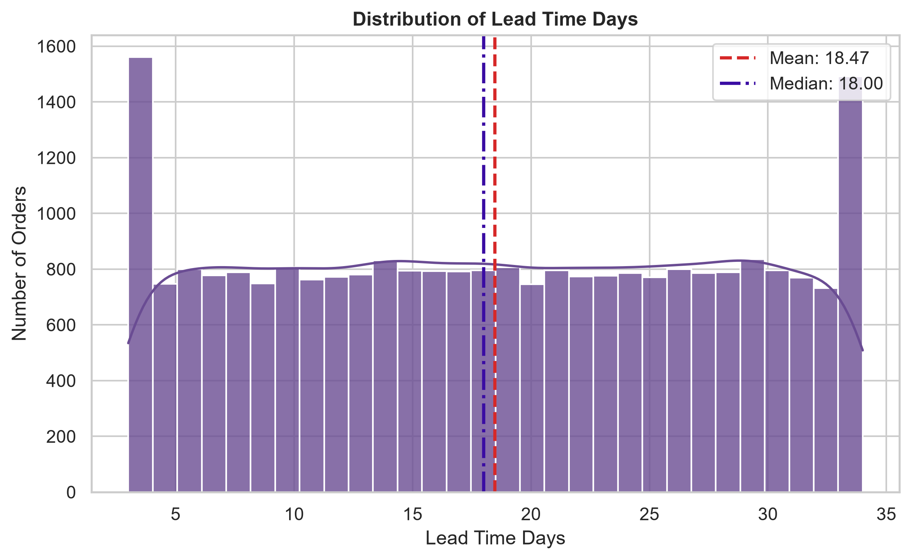
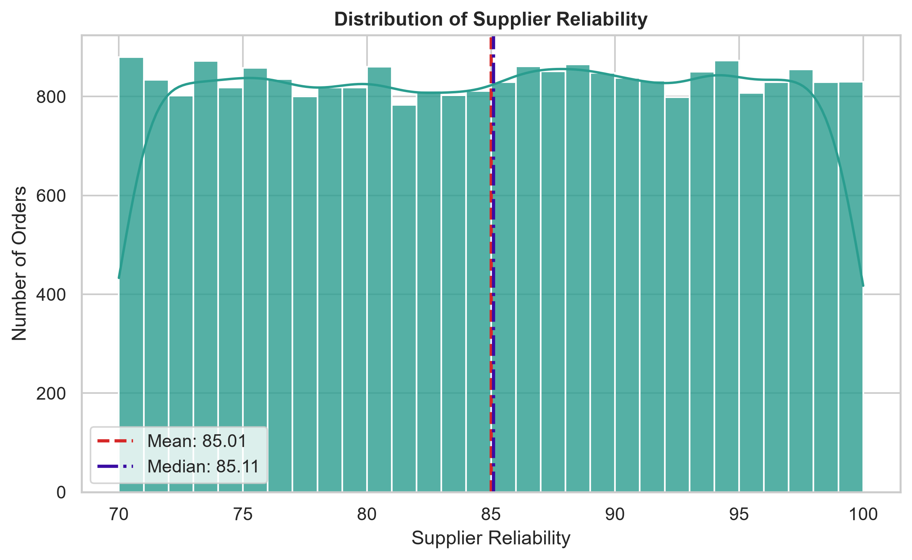
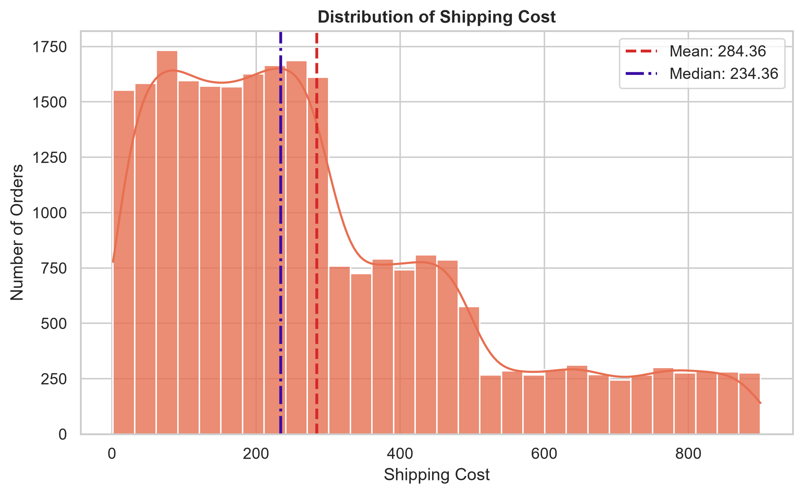
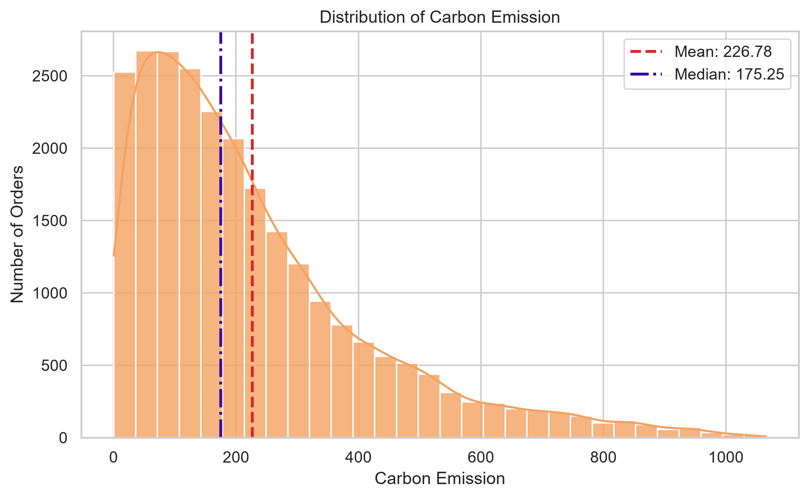
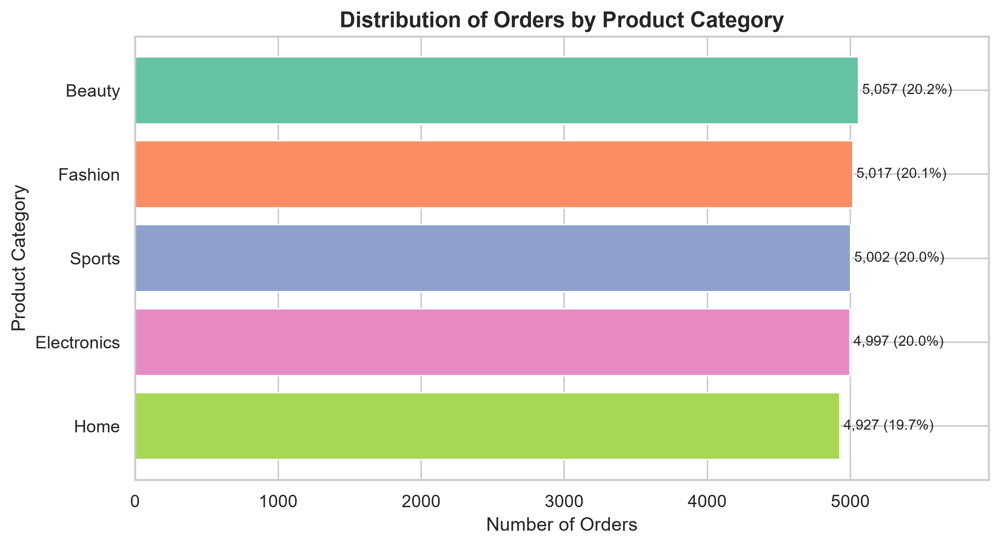
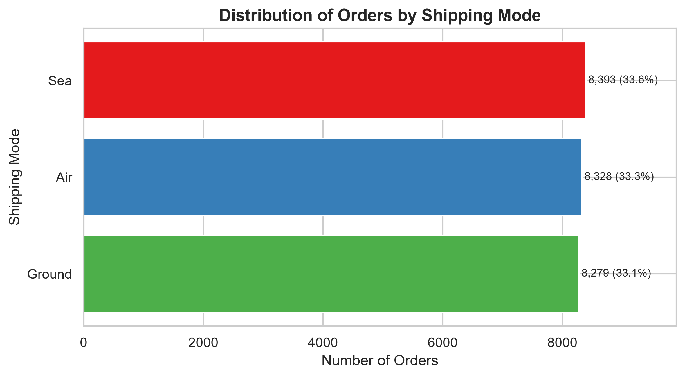
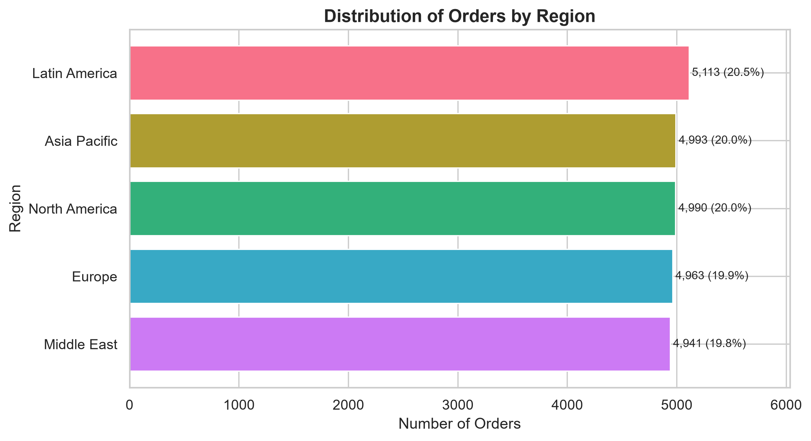
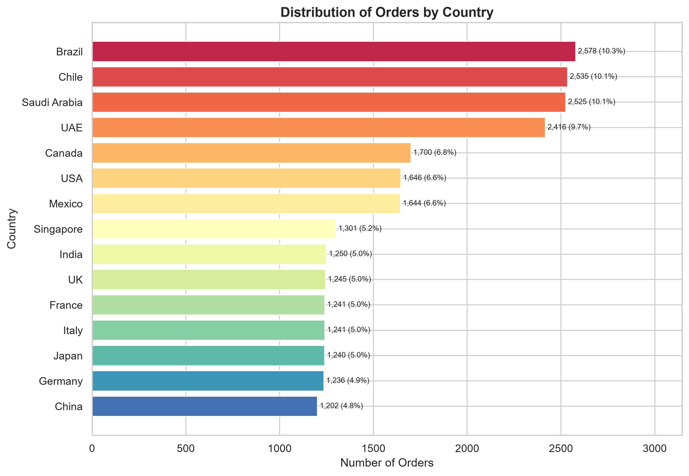

# AI-Driven Delivery Risk Prediction and Explainable Decision Support for Cross-Border E-Commerce Supply Chains

> This repository documents an end-to-end data analytics and machine learning capstone project focused on predicting delivery risk in cross-border e-commerce supply chains.

---

## Project Information

- **Author:** Kiruthikaa Natarajan Srinivasan
- **Capstone Paper Title:** AI-Driven Delivery Risk Prediction and Explainable Decision Support for Cross-Border E-Commerce Supply Chains
- **Course:** 44688-80 – MS Data Analytics Capstone
- **Instructor:** Ajay Bandi
- **University:** Northwest Missouri State University
- **Date Prepared:** July 2026
- **Last Updated:** July 19, 2026
- **Current Phase:** Exploratory Data Analysis
- **GitHub Repository:** [cb_supply_risk](https://github.com/Kiruthikaa2512/cb_supply_risk)
- **Project Documentation:** Will be added after the MkDocs website is published

---

## About This Repository

This repository contains the data, notebook, visualizations, project configuration, and documentation for my MS Data Analytics capstone project.

The project follows a complete analytics and machine learning workflow:

- Define the problem
- Collect and understand the data
- Inspect and clean the dataset
- Perform exploratory data analysis
- Prepare the data for machine learning
- Train and compare predictive models
- Evaluate model performance
- Explain the selected model using SHAP
- Present the final results through a PyShiny dashboard
- Publish project documentation using MkDocs

The main analysis notebook is available here:

- [Cross-Border Supply Chain Analysis Notebook](notebooks/cross_border_supply_chain_analysis.ipynb)

---

## Project Overview

Cross-border e-commerce supply chains involve suppliers, warehouses, transportation providers, ports, customs processes, tariffs, currencies, and changing market conditions.

These connected factors can increase the likelihood of shipment delays. Delivery delays may affect customer satisfaction, inventory availability, logistics costs, supplier performance, and overall supply-chain operations.

The purpose of this capstone project is to develop an AI-driven system that predicts whether a cross-border e-commerce shipment is likely to be delivered on time or delayed.

The project will also use explainable artificial intelligence methods to identify the factors influencing delivery-risk predictions. The final results are planned to be presented through a PyShiny dashboard that combines predictions, model explanations, visualizations, and decision-support information.

---

## Project Objective

The main objectives of this project are to:

1. Predict whether a cross-border e-commerce shipment will be delivered on time or delayed.
2. Examine operational, supplier, logistics, economic, inventory, and geographic factors related to delivery performance.
3. Compare multiple machine learning models and select the most suitable model.
4. Address the imbalance between delayed and on-time delivery records.
5. Use SHAP to explain the selected model's predictions.
6. Present predictions and explanations through a PyShiny dashboard.
7. Provide useful information that can support supply-chain risk-management decisions.

---

## Research Question

> Can operational, supplier, logistics, inventory, economic, and geographic attributes be used to predict whether a cross-border e-commerce shipment will be delivered on time or delayed?

---

## Data Source

The project uses the **Cross-Border E-Commerce Supply Chain Dataset** obtained from Kaggle.

- **Dataset:** [Cross-Border E-Commerce Supply Chain Dataset](https://www.kaggle.com/datasets/ziya07/cross-border-e-commerce-supply-chain-dataset)
- **Source Platform:** Kaggle
- **Dataset Creator:** Ziya
- **Dataset Type:** Synthetic cross-border e-commerce supply-chain data
- **Raw Data File:** `data/raw/cross_border_ecommerce_supply_chain_dataset.csv`
- **Cleaned Data File:** `data/processed/cross_border_ecommerce_supply_chain_cleaned.csv`

The dataset represents common cross-border e-commerce activities, including product sales, supplier performance, transportation, shipping costs, inventory levels, tariffs, port congestion, weather conditions, warehouse decisions, and delivery outcomes.

The dataset is used for academic analysis and remains subject to the terms provided on the original Kaggle dataset page.

---

## Dataset Summary

The original dataset contains:

- **25,000 records**
- **43 attributes**
- **730 unique dates**
- **5 product categories**
- **5 brands**
- **5 geographic regions**
- **15 destination countries**
- **2 customer segments**
- **4 warehouse identifiers**
- **3 shipping modes**
- **4 recommended warehouse choices**

The dataset covers the period from:

- **January 1, 2023**
- through **December 30, 2024**

The primary target variable is:

```text
Delivery_Time_OnTime
```

The target is interpreted as:

- `0` – Delayed
- `1` – On Time

---

## Project Workflow

The project is organized into the following stages:

1. Problem definition
2. Data collection
3. Initial data inspection
4. Data cleaning and validation
5. Exploratory Data Analysis
6. Feature selection and preprocessing
7. Training and testing split
8. Class-imbalance handling
9. Baseline model development
10. Machine learning model comparison
11. Model evaluation and selection
12. SHAP-based model explainability
13. PyShiny dashboard development
14. MkDocs documentation
15. Final capstone report and presentation

---

## Professional Project Practices

This project also includes practices that support a professional and reproducible analytics workflow.

| Area | Current Approach | Status |
|---|---|---|
| Environment management | Project-specific `.venv` virtual environment | Implemented |
| Dependency management | Packages documented through `requirements.txt` and `pyproject.toml` | Implemented |
| Version control | Git repository connected to GitHub | Implemented |
| Data organization | Separate `raw` and `processed` data folders | Implemented |
| Reproducibility | Notebook, cleaned dataset, and exported figures are versioned | Implemented |
| Documentation | README and MkDocs configuration | In progress |
| Code organization | Notebook analysis with a separate `src` folder for reusable code | In progress |
| Code-quality checks | Ruff and pre-commit may be enabled as reusable source code is added | Planned |
| Testing | Tests will be added for reusable preprocessing, prediction, and dashboard functions | Planned |
| Deployment | PyShiny dashboard deployment | Planned |

The project currently uses a standard Python virtual environment and `pip`. It does not depend on the `uv` setup commands included in the original starter template.

---

# Data Inspection and Cleaning

The original dataset was reviewed for:

- Standard missing values
- Blank strings
- Hidden missing-value placeholders
- Duplicate records
- Duplicate order identifiers
- Categorical inconsistencies
- Incorrect data types
- Invalid numerical ranges
- Invalid dates
- Month and year mismatches

## Data-Quality Results

- **Missing values:** 0
- **Blank-string values:** 0
- **Common missing-value placeholders:** 0
- **Exact duplicate rows:** 0
- **Duplicate `Order_ID` values:** 0
- **Invalid dates:** 0
- **Month mismatches:** 0
- **Year mismatches:** 0

No records or attributes were removed during cleaning.

## Cleaning Actions Completed

The following cleaning actions were applied:

- Created a separate cleaned dataframe
- Converted `Date` from text to datetime format
- Removed leading and trailing spaces from text attributes
- Preserved the original raw dataset
- Retained all 25,000 records
- Saved the cleaned dataset in the `data/processed` folder

The cleaned dataset contains:

- **25,000 records**
- **43 attributes**
- **0 missing values**
- **0 duplicate records**

---

# Dependent and Independent Variables

## Dependent Variable

The primary dependent variable is:

```text
Delivery_Time_OnTime
```

This variable represents whether an order was delivered on time or experienced a delay.

## Candidate Independent Variables

A total of **33 candidate independent variables** were selected for future modeling.

The candidate predictors represent:

- Calendar and time-related information
- Product and marketing information
- Customer and geographic information
- Supplier performance
- Inventory and warehouse conditions
- Transportation and logistics
- Economic and country-risk conditions
- Weather and port-congestion conditions

Examples include:

- `Lead_Time_Days`
- `Supplier_Reliability`
- `Port_Congestion_Index`
- `Shipping_Mode`
- `Distance_to_Customer`
- `Shipping_Cost`
- `Tariff_Rate`
- `Currency_Exchange_Rate`
- `Fuel_Cost_Index`
- `Inventory_Level`
- `Safety_Stock`
- `Weather_Index`
- `Carbon_Emission`

## Variables Excluded from the Initial Model

The following identifier fields were excluded because they do not represent meaningful predictive characteristics:

- `Order_ID`
- `Product_ID`

The original `Date` field was excluded from the initial predictor list because its time-related information is already represented by:

- `Week`
- `Month`
- `Year`

The following variables were identified as possible post-outcome, alternative-result, or optimization fields:

- `Service_Level`
- `Total_Logistics_Cost`
- `Stockout_Flag`
- `Demand_Next_Period`
- `Optimal_Replenishment_Qty`
- `Best_Warehouse_Choice`

These variables were excluded from the initial predictor list to reduce the risk of data leakage. The exclusions will be reviewed again before final model development.

---

# Exploratory Data Analysis

Exploratory Data Analysis was conducted using a separate dataframe created from the cleaned dataset.

A readable `Delivery_Status` column was added for charts and tables:

- `Delayed`
- `On Time`

The EDA dataframe therefore contains:

- **25,000 records**
- **44 attributes**

The additional attribute is used only for readability. The original binary target variable remains available for machine learning.

No scaling, encoding, resampling, class balancing, or outlier removal was performed before EDA.

---

## Target-Variable Distribution

The dataset contains:

- **19,278 delayed deliveries – 77.11%**
- **5,722 on-time deliveries – 22.89%**

The difference between the two classes is **13,556 records**.

This shows that the target variable is clearly imbalanced. A machine learning model could favor the larger delayed-delivery class and still appear accurate.

For this reason, future model evaluation will not depend on accuracy alone. Precision, recall, F1-score, ROC-AUC, precision-recall AUC, classification reports, and confusion matrices will also be considered.


---

## Descriptive Statistics of Important Numerical Variables

Selected numerical variables were reviewed using the mean, median, standard deviation, minimum, maximum, and skewness.

| Variable | Mean | Median | Standard Deviation | Minimum | Maximum | Skewness |
|---|---:|---:|---:|---:|---:|---:|
| Lead Time Days | 18.468 | 18.000 | 9.184 | 3.000 | 34.000 | -0.002 |
| Supplier Reliability | 85.007 | 85.105 | 8.685 | 70.001 | 100.000 | -0.009 |
| Port Congestion Index | 49.870 | 49.789 | 28.917 | 0.001 | 100.000 | 0.005 |
| Distance to Customer | 5,033.938 | 5,040.485 | 2,874.617 | 50.033 | 9,999.304 | -0.006 |
| Shipping Cost | 284.356 | 234.362 | 217.440 | 1.501 | 899.811 | 1.005 |
| Tariff Rate | 0.130 | 0.129 | 0.069 | 0.010 | 0.250 | 0.006 |
| Inventory Level | 2,555.696 | 2,560.000 | 1,412.651 | 100.000 | 4,999.000 | -0.010 |
| Safety Stock | 525.807 | 527.000 | 274.487 | 50.000 | 999.000 | -0.011 |
| Carbon Emission | 226.785 | 175.245 | 192.073 | 0.633 | 1,065.627 | 1.412 |

Most variables have mean and median values that are close to each other, with skewness values near zero.

This suggests that lead time, supplier reliability, port congestion, distance, tariff rate, inventory level, and safety stock have fairly balanced distributions.

`Shipping_Cost` and `Carbon_Emission` show positive skewness. Their mean values are higher than their median values because a smaller number of high-value observations pull the average upward.

The variables are also measured on different scales. This will need to be considered later when preparing the data for models that are affected by feature scale.

---

## Numerical Variable Distributions

### Lead Time

`Lead_Time_Days` is spread fairly evenly across its range. Its mean is **18.47 days**, and its median is **18 days**.



### Supplier Reliability

`Supplier_Reliability` is distributed fairly evenly between approximately 70 and 100. Its mean of **85.01** and median of **85.11** are almost the same.



### Shipping Cost

`Shipping_Cost` has a right-skewed distribution. Most orders are concentrated in the lower and middle cost ranges, while fewer orders have very high shipping costs.

Its mean is **284.36**, while its median is **234.36**.



### Carbon Emission

`Carbon_Emission` has the strongest right-skewed distribution among the variables reviewed so far.

Most observations are concentrated at lower emission values, while a smaller number extend beyond 1,000.

Its mean is **226.78**, while its median is **175.25**.



The high shipping-cost and carbon-emission values will not be removed automatically. They may represent valid supply-chain conditions and could contain useful information for predicting delivery delays.

---

## Product Category Distribution

Orders are distributed almost evenly across the five product categories.

| Product Category | Record Count | Percentage |
|---|---:|---:|
| Beauty | 5,057 | 20.228% |
| Fashion | 5,017 | 20.068% |
| Sports | 5,002 | 20.008% |
| Electronics | 4,997 | 19.988% |
| Home | 4,927 | 19.708% |

`Beauty` has the highest number of orders, while `Home` has the lowest. The difference between the highest and lowest categories is only 130 orders.

No product category is heavily overrepresented or underrepresented.



---

## Shipping Mode Distribution

The three shipping modes are distributed almost evenly.

| Shipping Mode | Record Count | Percentage |
|---|---:|---:|
| Sea | 8,393 | 33.572% |
| Air | 8,328 | 33.312% |
| Ground | 8,279 | 33.116% |

`Sea` has the highest number of orders, while `Ground` has the lowest. The difference between them is only 114 orders.



---

## Region Distribution

The orders are distributed almost evenly across the five geographic regions.

| Region | Record Count | Percentage |
|---|---:|---:|
| Latin America | 5,113 | 20.452% |
| Asia Pacific | 4,993 | 19.972% |
| North America | 4,990 | 19.960% |
| Europe | 4,963 | 19.852% |
| Middle East | 4,941 | 19.764% |

`Latin America` has the highest number of orders, while `Middle East` has the lowest.

The difference between the highest and lowest regions is only 172 orders, so there is no major regional imbalance.



---

## Country Distribution

Unlike the product-category, shipping-mode, and regional distributions, orders are not distributed evenly across all 15 countries.

| Country | Record Count | Percentage |
|---|---:|---:|
| Brazil | 2,578 | 10.312% |
| Chile | 2,535 | 10.140% |
| Saudi Arabia | 2,525 | 10.100% |
| UAE | 2,416 | 9.664% |
| Canada | 1,700 | 6.800% |
| USA | 1,646 | 6.584% |
| Mexico | 1,644 | 6.576% |
| Singapore | 1,301 | 5.204% |
| India | 1,250 | 5.000% |
| UK | 1,245 | 4.980% |
| France | 1,241 | 4.964% |
| Italy | 1,241 | 4.964% |
| Japan | 1,240 | 4.960% |
| Germany | 1,236 | 4.944% |
| China | 1,202 | 4.808% |

`Brazil` has the highest number of orders, followed by `Chile`, `Saudi Arabia`, and `UAE`.

`China` has the lowest number of orders.

Because the country sample sizes are different, raw delayed-order counts should not be used alone when comparing delivery performance. Delivery percentages will provide a fairer comparison during bivariate analysis.



---

## EDA Findings Completed So Far

The exploratory analysis completed so far shows that:

1. The target variable is imbalanced, with delayed deliveries representing 77.11% of the dataset.
2. Most selected numerical variables have fairly balanced distributions.
3. Shipping cost and carbon emission are right-skewed.
4. Product categories are distributed almost evenly.
5. Shipping modes are distributed almost evenly.
6. Geographic regions are distributed almost evenly.
7. Country-level order counts are less balanced.
8. High-value observations should be reviewed carefully instead of being removed automatically.
9. Category percentages must be considered when comparing delivery performance.

---

## Remaining EDA Work

The following analyses will be completed next:

- Customer-segment distribution
- Brand distribution
- Delivery performance by product category
- Delivery performance by shipping mode
- Delivery performance by region
- Delivery performance by country
- Numerical-variable comparison by delivery outcome
- Correlation analysis
- Correlation heatmap
- Outlier analysis using the Interquartile Range method
- Monthly delivery-performance analysis
- Final EDA summary

---

# Planned Machine Learning Analysis

## Planned Models

The following models are planned for comparison:

- Dummy Classifier
- Logistic Regression
- Random Forest
- Gradient Boosting

Additional models may be considered if they provide a meaningful improvement.

The data will be divided into training and testing sets using a stratified split so that both target classes remain represented.

## Class-Imbalance Handling

Because delayed deliveries represent most of the dataset, the following methods may be tested:

- Class weighting
- SMOTE
- Comparison against an unbalanced baseline
- Stratified cross-validation

The final approach will be selected based on model performance and its ability to identify both delivery classes correctly.

## Model Evaluation

Model performance will be evaluated using:

- Accuracy
- Precision
- Recall
- F1-score
- ROC-AUC
- Precision-Recall AUC
- Classification report
- Confusion matrix

Accuracy will not be used alone because of the imbalance in the target variable.

---

# Explainable AI with SHAP

SHAP will be applied after the best-performing model is selected.

The planned explainability analysis includes:

- Overall feature importance
- Direction of feature influence
- Global SHAP summary plots
- Individual shipment explanations
- Factors increasing predicted delivery risk
- Factors decreasing predicted delivery risk

The purpose of SHAP is to make the model's predictions easier to understand and support practical supply-chain decisions.

---

# Planned PyShiny Dashboard

The final PyShiny dashboard is planned to display:

- Shipment input information
- Predicted delivery outcome
- Delivery-risk probability
- On-time probability
- Main contributing factors
- SHAP-based explanation
- Model-performance summary
- Delivery-risk charts
- Decision-support recommendations

The dashboard will serve as the presentation layer for the prediction model and its explanations.

---

# Repository Organization

```text
cb_supply_risk/
├── data/
│   ├── raw/
│   │   └── cross_border_ecommerce_supply_chain_dataset.csv
│   └── processed/
│       └── cross_border_ecommerce_supply_chain_cleaned.csv
├── notebooks/
│   └── cross_border_supply_chain_analysis.ipynb
├── outputs/
│   └── figures/
│       ├── target_distribution.png
│       ├── lead_time_days_distribution.png
│       ├── supplier_reliability_distribution.png
│       ├── shipping_cost_distribution.png
│       ├── carbon_emission_distribution.png
│       ├── product_category_distribution.png
│       ├── shipping_mode_distribution.png
│       ├── region_distribution.png
│       └── country_distribution.png
├── src/
├── .gitattributes
├── .gitignore
├── LICENSE
├── mkdocs.yml
├── pyproject.toml
├── README.md
└── requirements.txt
```

## Main Project Files

| File or Folder | Purpose |
|---|---|
| `data/raw/` | Stores the original dataset without modification |
| `data/processed/` | Stores the cleaned dataset |
| `notebooks/` | Contains the step-by-step Jupyter analysis |
| `outputs/figures/` | Contains exported EDA visualizations |
| `src/` | Will contain reusable preprocessing, modeling, and dashboard code |
| `requirements.txt` | Lists the required Python packages |
| `pyproject.toml` | Stores Python project and tool configuration |
| `mkdocs.yml` | Stores MkDocs documentation configuration |
| `.gitignore` | Prevents local environments, secrets, and temporary files from being committed |
| `README.md` | Provides the main project overview and progress summary |

---

# Tools and Technologies

The project currently uses or plans to use:

- Python
- pandas
- NumPy
- Matplotlib
- Seaborn
- scikit-learn
- imbalanced-learn
- SHAP
- PyShiny
- Jupyter Notebook
- Visual Studio Code
- Git
- GitHub
- MkDocs

---

# Workflow 1: Set Up the Project Environment

## Clone the Repository

```bash
git clone https://github.com/Kiruthikaa2512/cb_supply_risk.git
```

## Move into the Project Folder

```bash
cd cb_supply_risk
```

## Create a Virtual Environment

```bash
python -m venv .venv
```

## Activate the Virtual Environment

For Windows PowerShell:

```powershell
.\.venv\Scripts\Activate.ps1
```

## Install the Required Packages

```bash
python -m pip install --upgrade pip
python -m pip install -r requirements.txt
```

---

# Workflow 2: Run the Analysis

Open the following notebook in Visual Studio Code or Jupyter:

```text
notebooks/cross_border_supply_chain_analysis.ipynb
```

Run the notebook cells in order because later sections depend on variables and dataframes created in earlier sections.

---

# Workflow 3: Update the Repository

After completing and reviewing new work:

```bash
git status
git add .
git commit -m "Describe the completed project update"
git push
```

The repository should be checked before every commit to avoid adding virtual environments, temporary files, secrets, or unnecessary outputs.

---

# Documentation

The repository includes an `mkdocs.yml` configuration file for future project documentation.

The documentation site is planned to include:

- Project overview
- Dataset description
- Data-cleaning process
- Exploratory analysis
- Modeling approach
- Model-evaluation results
- SHAP explanations
- PyShiny dashboard guide
- Final conclusions

The live documentation URL will be added after the MkDocs website is published through GitHub Pages.

---

# Current Project Status

## Completed

- Project folder and environment setup
- Git and GitHub repository setup
- Dataset loading
- Initial dataset inspection
- Missing-value assessment
- Duplicate-record assessment
- Categorical consistency review
- Numerical range review
- Date validation and conversion
- Data cleaning
- Cleaned dataset export
- Dependent-variable definition
- Candidate independent-variable selection
- Target-distribution analysis
- Numerical descriptive statistics
- Numerical univariate analysis
- Product-category distribution
- Shipping-mode distribution
- Region distribution
- Country distribution
- EDA chart export
- README project documentation

## In Progress

- Remaining categorical analysis
- Bivariate analysis
- Correlation analysis
- Outlier analysis
- Time-based delivery analysis
- Module 4 EDA discussion post
- MkDocs content preparation

## Planned

- Data preprocessing
- Training and testing split
- Class-imbalance handling
- Baseline modeling
- Logistic Regression
- Random Forest
- Gradient Boosting
- Model comparison and selection
- SHAP explainability
- PyShiny dashboard
- Automated code-quality checks
- Testing of reusable code
- MkDocs website publication
- Final capstone report
- Final presentation

---

# Academic Purpose

This repository was created as part of the MS Data Analytics Capstone course at Northwest Missouri State University.

The project is being developed in stages. The repository will be updated as new analysis, modeling, explainability, documentation, and dashboard components are completed.

---

# Author

**Kiruthikaa Natarajan Srinivasan**

MS Data Analytics Capstone  
Northwest Missouri State University  
July 2026